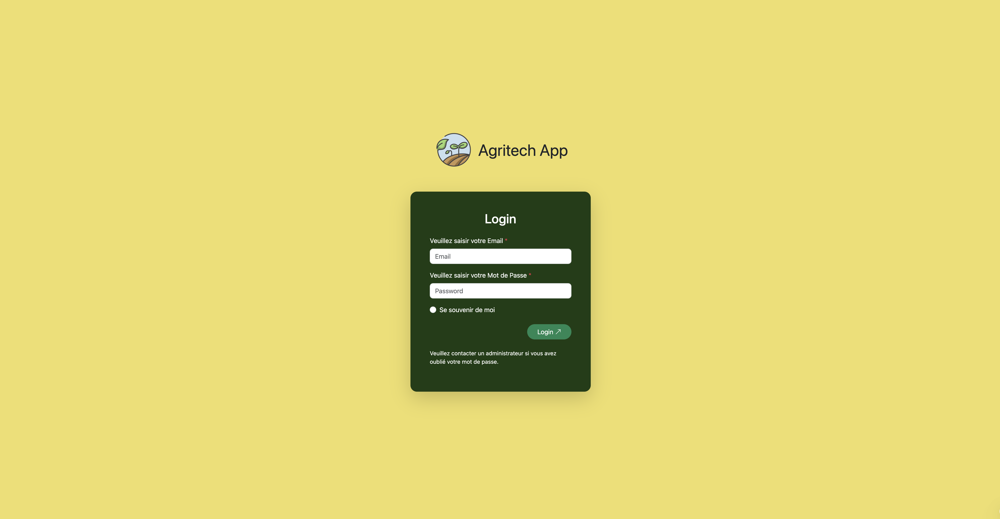
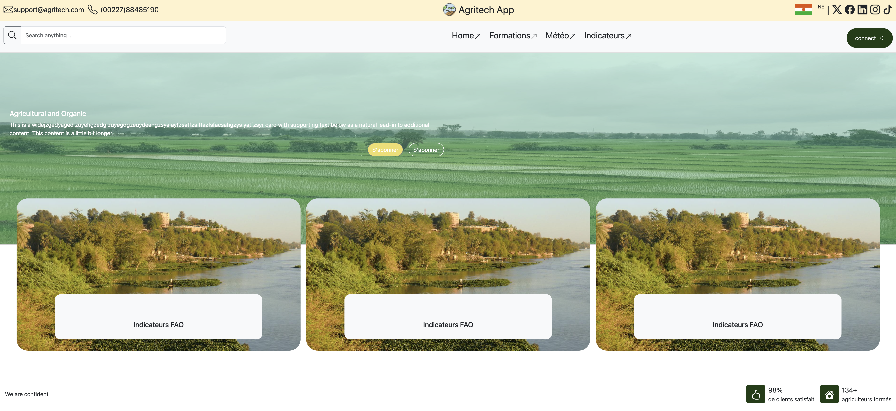
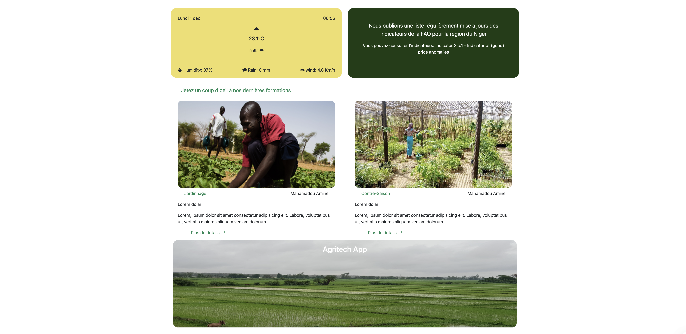
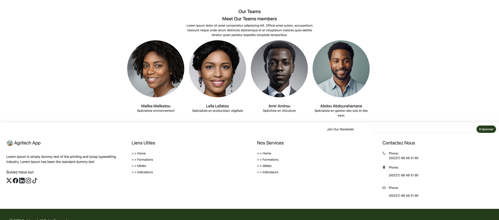

# 💻 Agritech App : Analyse Détaillée du Code Source

## Introduction et Stack Technique

Le projet Agritech App est une application web conçue pour le secteur agricole au Niger, se distinguant par son approche Mobile-First et l'utilisation intensive du framework Bootstrap 5.3. Le code HTML incorpore les liens CDN nécessaires pour Bootstrap CSS, les classes utilitaires de Flexbox, et la librairie Bootstrap Icons (v1.11) pour l'intégration visuelle des icônes sociales et fonctionnelles. La feuille de style externe style.css est dédiée à la personnalisation des couleurs (.verte, .jaune) et à la création d'animations spécifiques (:hover).

## 1. La Structure de la Navigation (Nav-1 et Nav-2)

L'en-tête de page utilise une structure de navigation double, positionnée de manière fixe et empilée :

### Nav-1 (Barre Supérieure) :
     Utilise position-fixed z-3 w-100 pour rester visible en haut de la page et éviter d'être recouverte par d'autres éléments.
    => Elle est divisée en trois sections (Gauche, Centre, Droite) avec justify-content-between à l'intérieur de .container-fluid.
    => Les informations de contact (email et téléphone) sont masquées sur les petits écrans (d-none d-lg-flex), suivant une approche d'affichage progressif pour optimiser l'espace mobile.
    => Les liens sociaux utilisent la classe .text-reset pour annuler la couleur de lien bleue par défaut de Bootstrap, ce qui est une bonne pratique pour l'intégration d'icônes. Le masquage conditionnel est géré par d-none d-md-flex.

### Nav-2 (Barre Principale) :
    => Elle est positionnée juste en dessous de Nav-1 en utilisant le style en ligne style="padding-top: 5em;" pour compenser la hauteur de la barre fixe supérieure.
    => Elle gère la navigation principale (Home, Formations, etc.) et intègre un composant de recherche (input-group).
    => Les éléments de menu utilisent une combinaison de d-flex et de listes (<ul> / <li>) pour l'alignement, avec une icône de flèche subtile (`bi bi-arrow-up-right`) pour indiquer que les liens sont actifs ou externes.

## 2. Le Composant Mobile (Offcanvas)

Pour une expérience mobile fluide, vous utilisez le composant Offcanvas de Bootstrap :

=> Déclenché par le bouton navbar-toggler (visible uniquement sur les petits écrans grâce à d-flex d-md-none).
=> Il s'ouvre depuis la gauche (offcanvas-start) et contient une version simplifiée et verticalement empilée de la navigation principale et des liens sociaux.
=> Notez l'utilisation du bouton de connexion stylisé Connect au sein du menu latéral pour un appel à l'action clair.

## 3. La Section Principale (Hero Section)

La page d'accueil commence par une section visuellement marquante, construite avec des techniques de positionnement CSS :

=> Une image de fond (Home Carroussel.jpg) est chargée avec une hauteur fixe (height: 34em;) pour garantir sa présence.
=> Un élément div de superposition (overlay) est placé par-dessus l'image avec position-absolute et une couleur semi-transparente (background-color: rgba(127, 255, 212, 0.3);), créant un effet visuel de douceur.
=> Le texte d'accroche est inséré dans un card-img-overlay à l'intérieur de l'overlay, positionné verticalement avec style="top: 9em;". La grille (row, col-12 col-md-6) est utilisée pour aligner le texte à gauche sur les grands écrans.

### 4. Cartes d'Indicateurs et Animations

Les cartes d'indicateurs représentent un point fort du design, utilisant des animations personnalisées définies dans style.css :

=> Les cartes pour grand écran sont positionnées de manière absolue sur la page (position-absolute) avec un décalage vertical précis (top: 76%;) pour chevaucher la section précédente.
=> Les classes .flex-support et .flex-hover gèrent l'effet d'expansion au survol (hover) :
    => flex-support:hover .flex-hover augmente la hauteur de la carte d'information (height: 15em;) et la déplace vers le haut (top: 7em !important;), révélant les détails.
=> Le contenu détaillé (.hidden) utilise visibility: hidden; et opacity: 0; combinés à une transition (transition: opacity 0.5s ease 0.3s;) pour une apparition en douceur lors du survol.
=> L'image elle-même (.img-animation) est stylisée pour effectuer une légère rotation et un zoom (transform: scale(1.2) rotate(4deg);) au survol, ajoutant de la profondeur.

## 5. Styles Personnalisés et Réactivité

Le fichier style.css gère les styles non natifs de Bootstrap :

=> Les couleurs récurrentes (.jaune, .verte) sont définies de manière globale, garantissant la cohérence.
=> Les Media Queries sont cruciales pour la réactivité, ajustant notamment la marge supérieure de la section .top-shut (margin-top) pour empêcher le chevauchement du contenu à mesure que l'écran rétrécit. Par exemple, sur les très petits écrans (max-width: 425px), la marge est dramatiquement augmentée à 44em pour s'adapter à la superposition des autres éléments.

En conclusion, ce projet démontre une maîtrise des conventions de mise en page réactives de Bootstrap, complétée par des techniques CSS avancées pour l'animation et le positionnement précis des éléments.

